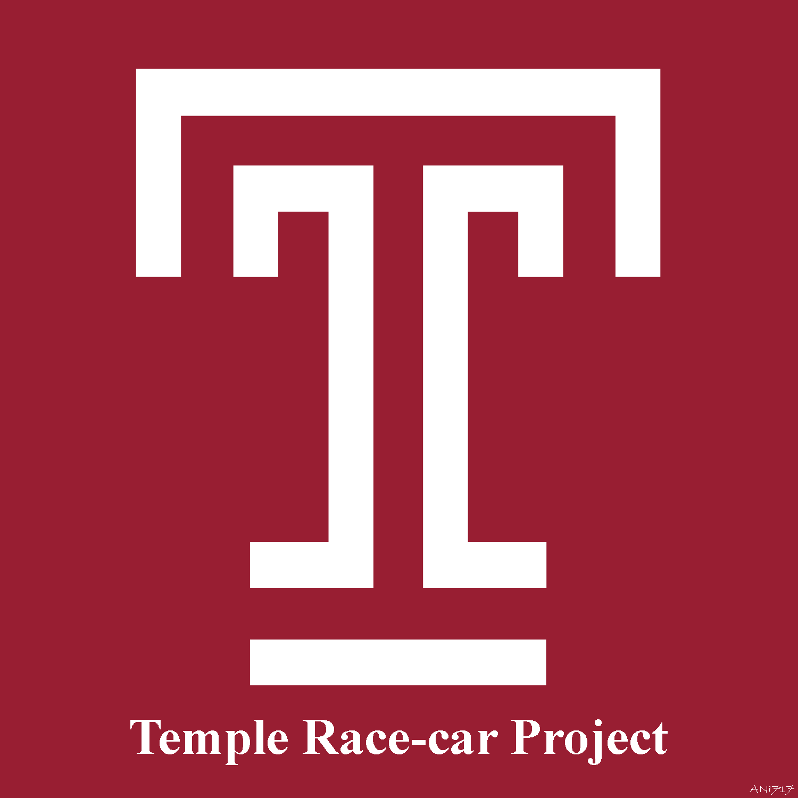

[![Contributors][contributors-shield]][contributors-url]
[![Forks][forks-shield]][forks-url]
[![Stargazers][stars-shield]][stars-url]
[![Issues][issues-shield]][issues-url]
[![MIT License][license-shield]][license-url]
[![LinkedIn][linkedin-shield]][linkedin-url]

<!-- PROJECT LOGO -->
<br />
<p align="center">
  <a href="https://github.com/ANI717/race-car">
    
  </a>

  <h1 align="center">Temple Race-car Project - Deep Learning Repository</h1>
</p>

We are developing an End-to-end Learning Framework for Autonomous Driving with Regression Model Approach. The Framework contains a stack of Convolutional Layers for Preprocessing and Feature Extraction from Images, followed by Fully Connected Layers on top. The whole architecture is defined as Convolutional Nueral Networks or ConvNets (CNN) in concurrent literatures.

## Colaborators
[Computer Fusion Laboratory (CFL) - Temple University College of Engineering](https://sites.temple.edu/cflab/people/)
* [Animesh Bala Ani](https://www.linkedin.com/in/ani717/)
* [Michael Nghe](https://sites.temple.edu/cflab/people/)
* [Dr. Li Bai](https://engineering.temple.edu/about/faculty-staff/li-bai-lbai)

## Table of Contents
+ [Sample Prediction Test](#sample) <br/>
+ [Environment SetUp](#env) <br/>
  - [Docker](#env-docker) <br/>
  - [Windows (Anaconda)](#env-win-conda) <br/>
    * [Anaconda](#env-win-conda) <br/>
    * [PIP](#env-win-pip) <br/>
  - [Raspberry Pi 4](#env-rasp) <br/>
+ [Software Repository](#soft) <br/>
  - [Driver Softwares](#soft-driver) <br/>
  - [Neural Network](#soft-nn) <br/>
  - [Supportive Tools](#soft-tools) <br/>
+ [Database](#data) <br/>

## Sample Prediction Test <a name="sample"></a>
Prediction on Captured Video with a trained model.<br/>

<br/>

<br/>

## Environment SetUp <a name="env"></a>
### Docker <a name="env-docker"></a>
Install Docker for Proper Platform.
```
https://docs.docker.com/get-docker/
```
Download the repository and run following commands.
```
cd race-car
docker build --tag race-car-docker .
docker run -d --name race-car-container race-car-docker
docker exec -it race-car-container /bin/bash
```

### Windows (Anaconda) <a name="env-win-conda"></a>
Install Anaconda (64 Bit, Python 3.7 version or higher).
```
https://www.anaconda.com/products/individual
```
Install OpenCV and Torch modules with Anaconda prompt.
```
pip install opencv-contrib-python
conda install pytorch -c pytorch
conda install torchvision -c pytorch
```

### Windows (PIP) <a name="env-win-pip"></a>
Install Python (Python 3.9 version or higher).
```
https://www.python.org/downloads/
```
Open Windows PowerShell and run following commands.
```
py -m pip install --upgrade pip
py -m pip install --user virtualenv
py -m venv ani717\deeplearn
.\ani717\deeplearn\Scripts\activate
py -m pip install --upgrade pip
py -m pip install torch===1.7.1+cu110 torchvision===0.8.2+cu110 torchaudio===0.7.2 -f https://download.pytorch.org/whl/torch_stable.html
py -m pip install pandas
py -m pip install matplotlib
py -m pip install opencv-contrib-python
deactivate
```
Activate Virtual Environment.
```
.\ani717\deeplearn\Scripts\activate
```

### Raspberry Pi 4 (OS: raspios-buster-arm64) <a name="env-rasp"></a>
Run following commands to install PyTorch, Torchvision, Pandas, Matplotlib and OpenCV.
```
sudo apt update
sudo apt install libopenblas-dev libblas-dev m4 cmake cython python3-yaml libatlas-base-dev -y
export ONNX_ML=1
git clone --recursive https://github.com/pytorch/pytorch
cd pytorch
sudo -E python3 setup.py install
python3 -m pip install --upgrade pip
python3 -m pip install torchvision
python3 -m pip install pandas
python3 -m pip install --upgrade Pillow
python3 -m pip install matplotlib
python3 -m pip install opencv-contrib-python
```
Or follow the instructions from [here](https://github.com/ANI717/headless_raspberrypi_setup) to setup everything from the beginning.

## Software Repository (Python, OpenCV, PyTorch) <a name="soft"></a>
### Driver Softwares <a name="soft-driver"></a>
* Creates and refines CSV files contaning list of image directory paths.
```
refine_dataset.py
```
* Removes unwanted images with false annotation and refine dataset visually.
```
refine_visually.py
```
* Driver software to run training sessions
```
train.py
```
* Driver software to run testing sessions
```
test.py
```
* Driver software to calculate required time to make prediction on one image
```
time_count.py
```
* Driver software to test prediction visually
```
visualize_prediction.py
```

### Neural Network <a name="soft-nn"></a>
* Contains the Deep Neural Network architecture
```
racecarNet.py
```

### Supportive Tools <a name="soft-tools"></a>
* Contains necessary tools to run training and testiong sessions
```
_train_test.py
```
* Contains utility tools for parsing image and labels from directory path
```
_parser.py
```
* Contains utility tools for generating data in proper format to support deep learning sessions
```
_datagen.py
```
* Contains required tools to prepare proper dataset for deep learning sessions
```
_data_handler.py
```
* Contains tools to show performance visually
```
_visualization.py
```

## Database <a name="data"></a>
* Contains raw images collected in different environments and time period. The image repository remains immutable during whole session.
```
data/images/
```
* Contanis CSV files with lists of image directories for deep learning session. The lists contain randomly shuffled image set along with 5 fold cross validation set.
```
data/lists/
```
* Contains .pth model files storing learned weights from deep learning sessions.
```
models/
```


<!-- MARKDOWN LINKS & IMAGES -->
<!-- https://www.markdownguide.org/basic-syntax/#reference-style-links -->
[contributors-shield]: https://img.shields.io/github/contributors/ANI717/race-car.svg?style=flat-square
[contributors-url]: https://github.com/ANI717/race-car/graphs/contributors
[forks-shield]: https://img.shields.io/github/forks/ANI717/race-car.svg?style=flat-square
[forks-url]: https://github.com/ANI717/race-car/network/members
[stars-shield]: https://img.shields.io/github/stars/ANI717/race-car.svg?style=flat-square
[stars-url]: https://github.com/ANI717/race-car/stargazers
[issues-shield]: https://img.shields.io/github/issues/ANI717/race-car.svg?style=flat-square
[issues-url]: https://github.com/ANI717/race-car/issues
[license-shield]: https://img.shields.io/github/license/ANI717/race-car.svg?style=flat-square
[license-url]: https://github.com/ANI717/race-car/blob/master/LICENSE
[linkedin-shield]: https://img.shields.io/badge/-LinkedIn-black.svg?style=flat-square&logo=linkedin&colorB=555
[linkedin-url]: https://www.linkedin.com/in/ani717
